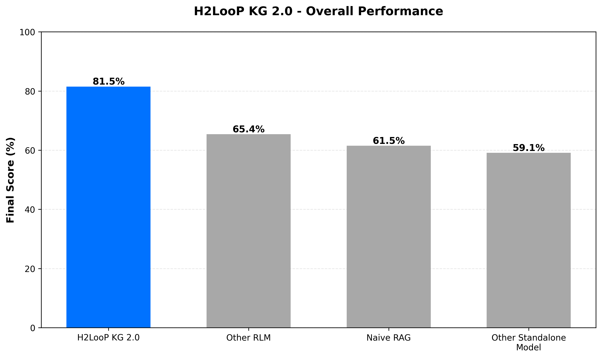
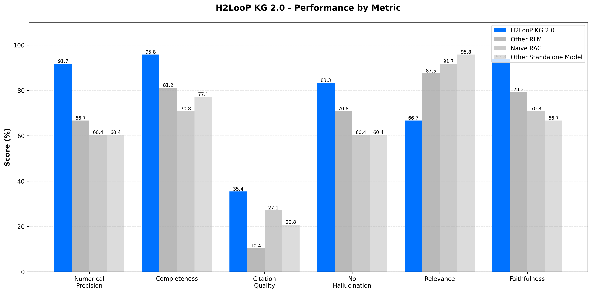
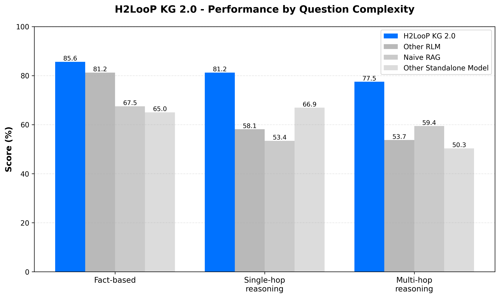

# H2LooP Benchmark Results

---

## 1. H2LooP KG 2.0

### 1.1 Overview
The system was evaluated on a curated set of high-quality technical documents including datasheets, specifications, and technical manuals.

### 1.2 Performance Results

#### Overall Performance

| System | Final Score | Avg Response Time |
|--------|-------------|-------------------|
| **H2LooP KG 2.0** | **81.5%** | 55.1s |
| Other RLM | 65.4% | 47.0s |
| Naive RAG | 61.5% | 7.4s |
| Other Standalone Model | 59.1% | 36.7s |

H2LooP KG 2.0 outperforms baseline approaches by significant margins:
- **24.7% better** than Other Standalone Model
- **20.0% better** than Naive RAG
- **16.1% better** than Other RLM

#### Performance by Metric

| Metric | H2LooP KG 2.0 | Other RLM | Naive RAG | Other Standalone Model |
|--------|---------------|-----------|-----------|------------------------|
| Numerical Precision | **91.7%** | 66.7% | 60.4% | 60.4% |
| Completeness | **95.8%** | 81.2% | 70.8% | 77.1% |
| Citation Quality | **35.4%** | 10.4% | 27.1% | 20.8% |
| No Hallucination | **83.3%** | 70.8% | 60.4% | 60.4% |
| Relevance | 66.7% | 87.5% | **91.7%** | 95.8% |
| Faithfulness | 93.8% | 79.2% | 70.8% | 66.7% |

#### Performance by Question Complexity

| Category | H2LooP KG 2.0 | Other RLM | Naive RAG | Other Standalone Model |
|----------|---------------|-----------|-----------|------------------------|
| Fact-based | **85.6%** | 81.2% | 67.5% | 65.0% |
| Single-hop reasoning | **81.2%** | 58.1% | 53.4% | 66.9% |
| Multi-hop reasoning | **77.5%** | 53.7% | 59.4% | 50.3% |

### 1.3 Key Strengths

- **Exceptional Numerical Precision**: 91.7% accuracy in extracting exact technical specifications
- **Superior Completeness**: 95.8% coverage of all required information
- **Reduced Hallucinations**: 83.3% hallucination-free responses with better grounding in actual content
- **Enhanced Citation Quality**: Explicitly references tables, sections, and page numbers for verification
- **Strong Multi-hop Reasoning**: 77.5% accuracy on complex questions requiring cross-document reasoning
- **No Context Length Limitation**: Handles arbitrarily large document collections

---

## 2. H2LooP PDF Parser

### 2.1 Overview

The system was evaluated across four key dimensions: OCR Quality, Table Extraction, Document Structure, and Reading Order.

### 2.2 Overall Performance

| Rank | Parser | Final Score | OCR Quality | Table Extraction | Structure | Reading Order |
|------|--------|-------------|-------------|------------------|-----------|---------------|
| 1 | **H2LooP PDF Parser** | **0.6519** | **0.4743** | **0.7103** | **0.8926** | **0.4683** |
| 2 | H2LooP PDF Parser (Rasterized) | 0.6506 | 0.4735 | 0.7100 | 0.8926 | 0.4683 |
| 3 | Other OCR | 0.5417 | 0.4090 | 0.4790 | 0.5814 | 0.5502 |
| 4 | Other Classical Parser (Marker) | 0.5132 | 0.3113 | 0.4253 | 0.8281 | 0.5244 |
| 5 | Other Classical Parser (Markitdown) | 0.2731 | 0.3441 | 0.0000 | 0.5287 | 0.1808 |

H2LooP PDF Parser was evaluated across four dimensions:

- **OCR Quality**: Character and word-level recognition accuracy
- **Table Extraction**: Structural preservation and content extraction
- **Document Structure**: Hierarchy and element detection
- **Reading Order**: Block sequencing in multi-column layouts

### 2.3 Key Strengths

**Excellent Document Structure Recognition**
- 89.26% overall structure score
- 96.53% accuracy in identifying headers, paragraphs, and bullets
- 91.70% hierarchy preservation maintains document organization
- 78.62% accuracy in distinguishing header levels

**Strong Table Extraction**
- 71.03% overall table extraction score
- 90.33% shape accuracy - correctly identifies table dimensions
- 73.14% exact F1, 76.99% fuzzy F1 - strong cell-level accuracy
- 68.80% TEDS score - maintains hierarchical table structure
- Handles complex scenarios: merged cells, multi-row headers, nested tables

**Exceptional Rasterization Resilience**
- Only 0.20% performance drop on rasterized PDFs
- Demonstrates production-ready robustness for diverse document sources
- Maintains consistent performance across native and image-based PDFs

**Balanced OCR Performance**
- 68.3% character-level accuracy
- 0.3358 Character Error Rate
- 2.6362 Word Error Rate

---
