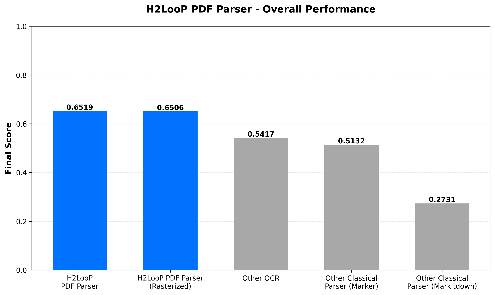
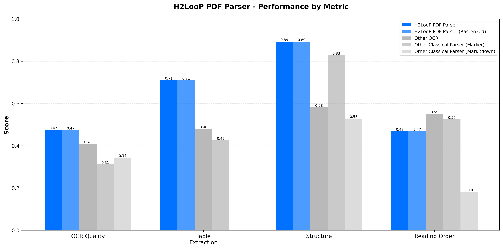

# H2LooP PDF Parser

### 1 Overview

The system was evaluated across four key dimensions: OCR Quality, Table Extraction, Document Structure, and Reading Order.

### 2 Overall Performance

| Rank | Parser | Final Score | OCR Quality | Table Extraction | Structure | Reading Order |
|------|--------|-------------|-------------|------------------|-----------|---------------|
| 1 | **H2LooP PDF Parser** | **0.6519** | **0.4743** | **0.7103** | **0.8926** | **0.4683** |
| 2 | H2LooP PDF Parser (Rasterized) | 0.6506 | 0.4735 | 0.7100 | 0.8926 | 0.4683 |
| 3 | Other OCR | 0.5417 | 0.4090 | 0.4790 | 0.5814 | 0.5502 |
| 4 | Other Classical Parser (Marker) | 0.5132 | 0.3113 | 0.4253 | 0.8281 | 0.5244 |
| 5 | Other Classical Parser (Markitdown) | 0.2731 | 0.3441 | 0.0000 | 0.5287 | 0.1808 |

H2LooP PDF Parser was evaluated across four dimensions:

- **OCR Quality**: Character and word-level recognition accuracy
- **Table Extraction**: Structural preservation and content extraction
- **Document Structure**: Hierarchy and element detection
- **Reading Order**: Block sequencing in multi-column layouts

### 3 Key Strengths

**Excellent Document Structure Recognition**
- 89.26% overall structure score
- 96.53% accuracy in identifying headers, paragraphs, and bullets
- 91.70% hierarchy preservation maintains document organization
- 78.62% accuracy in distinguishing header levels

**Strong Table Extraction**
- 71.03% overall table extraction score
- 90.33% shape accuracy - correctly identifies table dimensions
- 73.14% exact F1, 76.99% fuzzy F1 - strong cell-level accuracy
- 68.80% TEDS score - maintains hierarchical table structure
- Handles complex scenarios: merged cells, multi-row headers, nested tables

**Exceptional Rasterization Resilience**
- Only 0.20% performance drop on rasterized PDFs
- Demonstrates production-ready robustness for diverse document sources
- Maintains consistent performance across native and image-based PDFs

**Balanced OCR Performance**
- 68.3% character-level accuracy
- 0.3358 Character Error Rate
- 2.6362 Word Error Rate

---
