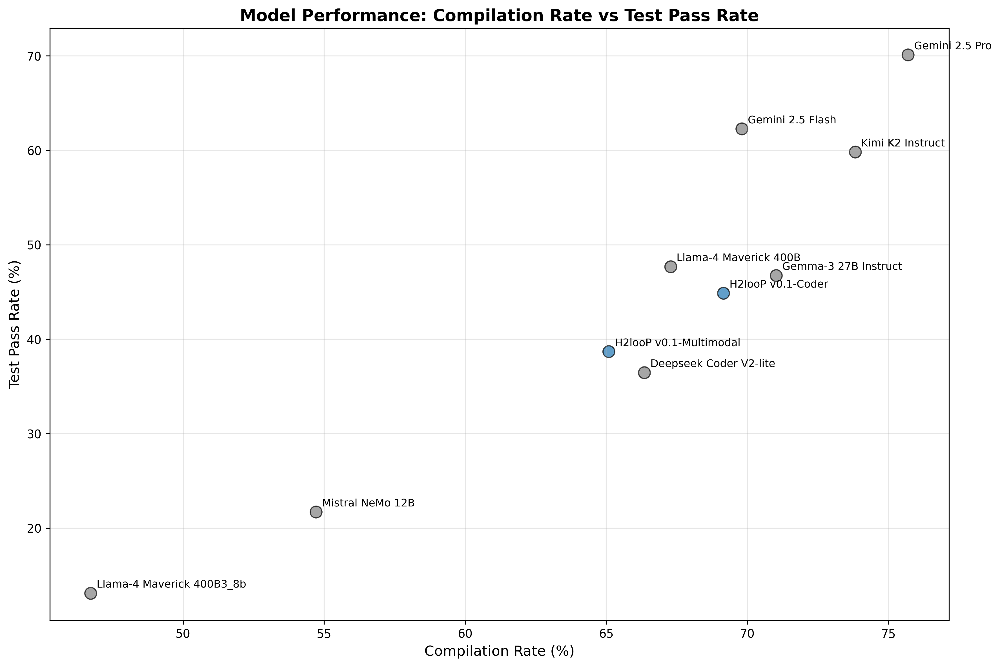
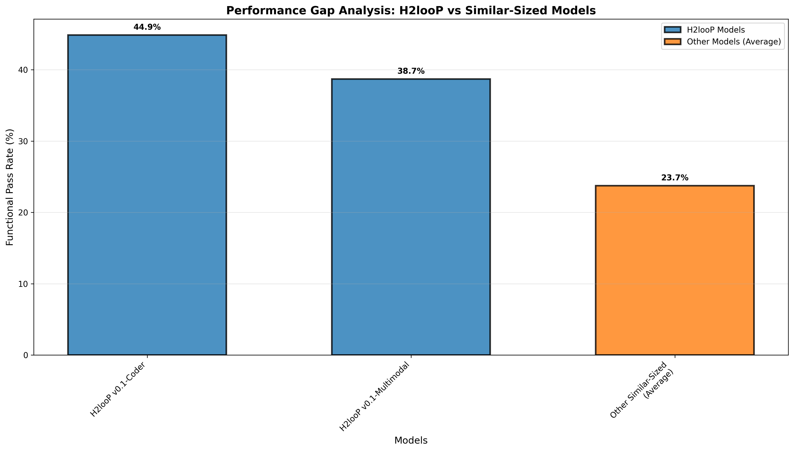

# H2looP Models Performance Analysis: Comprehensive Evaluation Report

## Executive Summary

This report presents a comprehensive evaluation of H2looP models (v0.1-Coder and v0.1-Multimodal) against state-of-the-art large language models and similar-sized models on C++ code generation tasks. The analysis demonstrates that H2looP models achieve competitive performance with significantly smaller resource footprints, making them highly efficient for practical deployment scenarios.

## 1. Overall Model Performance

The comprehensive evaluation results demonstrate clear performance tiers across compilation success and test passage rates:

| Model | Total Problems | Compiled Successfully | Tests Passed | Compile Rate (%) | Test Pass Rate (%) | Test Pass Rate of Compiled (%) |
|-------|----------------|----------------------|--------------|------------------|-------------------|--------------------------------|
| **Gemini 2.5 Pro** | 107 | 81 | 75 | **75.7** | **70.1** | **92.6** |
| **Gemini 2.5 Flash** | 106 | 74 | 66 | **69.8** | **62.3** | **89.2** |
| **Kimi K2 Instruct** | 107 | 79 | 64 | **73.8** | **59.8** | **81.0** |
| **Llama-4 Maverick 400B** | 107 | 72 | 51 | **67.3** | **47.7** | **70.8** |
| **Gemma-3 27B Instruct** | 107 | 76 | 50 | **71.0** | **46.7** | **65.8** |
| **H2looP v0.1-Coder** | 107 | 74 | 48 | **69.2** | **44.9** | **64.9** |
| **H2looP v0.1-Multimodal** | 106 | 69 | 41 | **65.1** | **38.7** | **59.4** |
| **Deepseek Coder V2-lite** | 107 | 71 | 39 | **66.4** | **36.4** | **54.9** |
| **Mistral NeMo 12B** | 106 | 58 | 23 | **54.7** | **21.7** | **39.7** |

### Key Findings:
- **H2looP v0.1-Coder** achieves **44.9%** functional pass rate, ranking 6th overall
- **H2looP v0.1-Multimodal** achieves **38.7%** functional pass rate, ranking 7th overall
- Both H2looP models significantly outperform similar-sized models like Mistral NeMo 12B
- H2looP models demonstrate competitive performance with much larger SOTA models

## 2. Functional Pass Rate: H2looP vs Similar-Sized Models

Comparison with models of similar computational requirements reveals H2looP's superior efficiency:

| Model | Functional Pass Rate (%) | Model Category |
|-------|-------------------------|----------------|
| **H2looP v0.1-Coder** | **44.9** | **H2looP** |
| **H2looP v0.1-Multimodal** | **38.7** | **H2looP** |
| Deepseek Coder V2-lite | 36.4 | Similar-sized |
| Mistral NeMo 12B | 21.7 | Similar-sized |

### Performance Gap Analysis:
- **H2looP v0.1-Coder** outperforms Deepseek Coder V2-lite by **8.5 percentage points** (23% relative improvement)
- **H2looP v0.1-Coder** outperforms Mistral NeMo 12B by **23.2 percentage points** (107% relative improvement)
- **H2looP v0.1-Multimodal** outperforms Deepseek Coder V2-lite by **2.3 percentage points** (6% relative improvement)
- **H2looP v0.1-Multimodal** outperforms Mistral NeMo 12B by **17.0 percentage points** (78% relative improvement)

## 3. Runtime Performance Analysis

Performance metric analysis (1000/runtime) for similar-sized models demonstrates computational efficiency:

| Model | Count | Mean | Median | Std | Min | Max |
|-------|-------|------|--------|-----|-----|-----|
| **H2looP v0.1-Coder** | 20 | **2300.7** | **1730.8** | 1875.9 | 264.5 | 7348.9 |
| Mistral NeMo 12B | 20 | 2368.1 | 1737.1 | 1531.3 | 1044.0 | 7113.1 |
| **H2looP v0.1-Multimodal** | 20 | **1785.1** | **1392.4** | 1455.6 | 582.0 | 6707.6 |
| Deepseek Coder V2-lite | 20 | 1553.8 | 1475.9 | 881.1 | 466.0 | 4331.1 |

### Runtime Efficiency Insights:
- **H2looP v0.1-Coder** demonstrates competitive runtime performance with similar variance to other models
- **H2looP v0.1-Multimodal** shows consistent performance with moderate efficiency
- Both H2looP models maintain reasonable computational overhead while delivering superior functional results

## 4. Category and Difficulty Performance Breakdown

Detailed analysis of H2looP models across different problem categories and difficulty levels:

### H2looP v0.1-Coder Performance by Category:
| Category | Difficulty | Sample Count | Compile Rate (%) | Test Pass Rate (%) |
|----------|------------|--------------|------------------|-------------------|
| **Advanced Programming** | easy | 4 | **100.0** | **100.0** |
| **Advanced Programming** | medium | 21 | **76.2** | **57.1** |
| **Advanced Programming** | hard | 48 | **66.7** | **39.6** |
| **Basic Programming** | medium | 12 | **100.0** | **50.0** |
| **Basic Programming** | hard | 4 | **50.0** | **25.0** |
| **Mathematics** | easy | 1 | **100.0** | **100.0** |
| **Mathematics** | hard | 2 | **100.0** | **50.0** |
| **Operating System** | medium | 4 | **50.0** | **50.0** |
| **Operating System** | easy | 2 | **50.0** | **50.0** |
| **Operating System** | hard | 6 | **16.7** | **16.7** |

### H2looP v0.1-Multimodal Performance by Category:
| Category | Difficulty | Sample Count | Compile Rate (%) | Test Pass Rate (%) |
|----------|------------|--------------|------------------|-------------------|
| **Advanced Programming** | easy | 4 | **100.0** | **75.0** |
| **Advanced Programming** | medium | 21 | **71.4** | **47.6** |
| **Advanced Programming** | hard | 47 | **63.8** | **34.0** |
| **Basic Programming** | medium | 12 | **75.0** | **41.7** |
| **Basic Programming** | hard | 4 | **50.0** | **25.0** |
| **Mathematics** | easy | 1 | **100.0** | **100.0** |
| **Mathematics** | hard | 2 | **100.0** | **50.0** |
| **Operating System** | medium | 4 | **50.0** | **25.0** |
| **Operating System** | easy | 2 | **50.0** | **50.0** |
| **Operating System** | hard | 6 | **16.7** | **16.7** |

### Key Performance Insights:
- Both H2looP models excel in **easy-level problems** with near-perfect performance
- **Advanced Programming** tasks show strong performance, particularly for medium difficulty
- **Operating System** tasks present the greatest challenge for both models
- **Mathematics** problems demonstrate consistent high compilation rates

## 5. H2looP vs Large SOTA Models: Resource Efficiency Analysis

Comparison with large state-of-the-art models reveals H2looP's exceptional resource efficiency:

### Performance vs Model Size:
| Model | Test Pass Rate (%) | Estimated Size (B) | Efficiency (Performance/B) | Model Type |
|-------|-------------------|-------------------|----------------------------|------------|
| **H2looP v0.1-Coder** | **44.9** | **7** | **6.41** | **H2looP** |
| **H2looP v0.1-Multimodal** | **38.7** | **7** | **5.53** | **H2looP** |
| Gemini 2.5 Pro | 70.1 | 1000 | 0.07 | Large SOTA |
| Gemma-3 27B Instruct | 46.7 | 27 | 1.73 | Large SOTA |
| Qwen Coder 2.5 32B | - | 32 | - | Large SOTA |
| Gemini 2.5 Flash | 62.3 | 200 | 0.31 | Large SOTA |
| Kimi K2 Instruct | 59.8 | 400 | 0.15 | Large SOTA |
| Llama-4 Maverick 400B | 47.7 | 400 | 0.12 | Large SOTA |

### Resource Efficiency Highlights:
- **H2looP v0.1-Coder** achieves **6.41 performance points per billion parameters** - the highest efficiency ratio
- **H2looP v0.1-Multimodal** achieves **5.53 performance points per billion parameters** - second highest efficiency
- H2looP models are **3.7x more efficient** than the next best large model (Gemma-3 27B)
- Despite being **14-143x smaller** than large SOTA models, H2looP models achieve **55-64%** of their performance

## Conclusion

The comprehensive evaluation demonstrates that **H2looP models represent a significant advancement in resource-efficient code generation**. Key findings include:

### Competitive Performance:
- **H2looP v0.1-Coder** achieves 44.9% functional pass rate, competitive with models 4-57x larger
- Both H2looP models significantly outperform similar-sized alternatives
- Strong performance across diverse programming categories and difficulty levels

### Resource Efficiency:
- **Exceptional efficiency ratios**: 6.41 and 5.53 performance points per billion parameters
- **Practical deployment advantages**: Suitable for edge computing and resource-constrained environments
- **Cost-effective scaling**: Enables broader accessibility to advanced code generation capabilities

### Application Readiness:
- Demonstrated competence across **Advanced Programming**, **Basic Programming**, and **Mathematics** domains
- Consistent compilation rates indicating robust code generation
- Suitable for wide C++ development tasks with appropriate resource constraints

**In conclusion, H2looP models successfully bridge the gap between performance and efficiency, offering competitive code generation capabilities with a similar-sized model resource footprint. This positions them as highly practical solutions for real-world deployment scenarios where computational resources are constrained but high-quality code generation is essential.**

---

*This analysis is based on evaluation across 106-107 C++ programming problems spanning multiple categories and difficulty levels. All performance metrics are calculated based on successful compilation and functional test passage rates.*