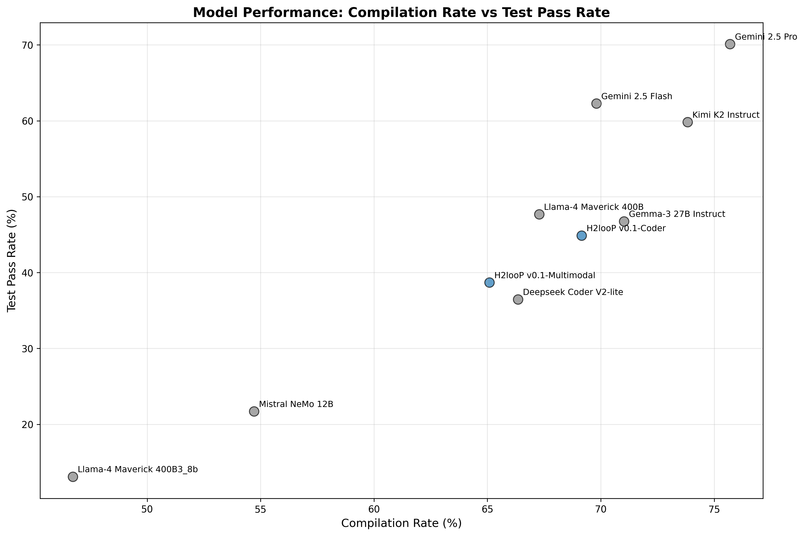
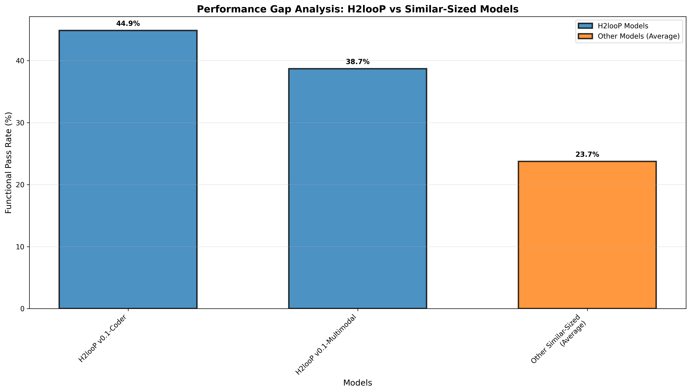
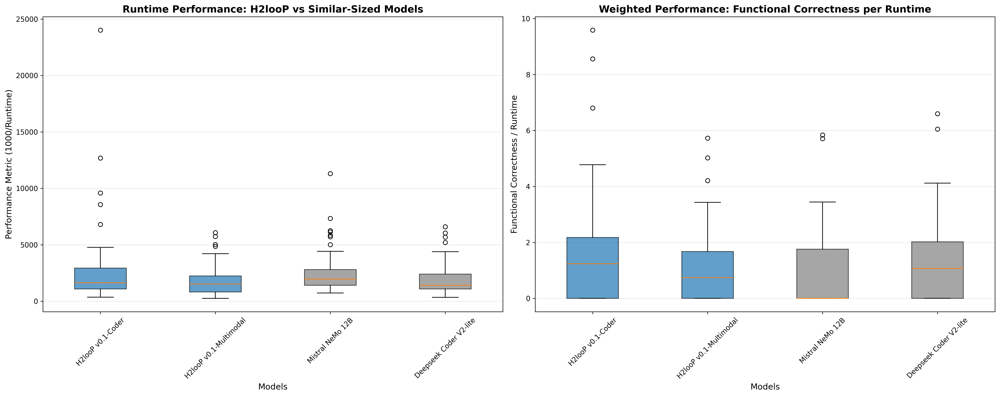
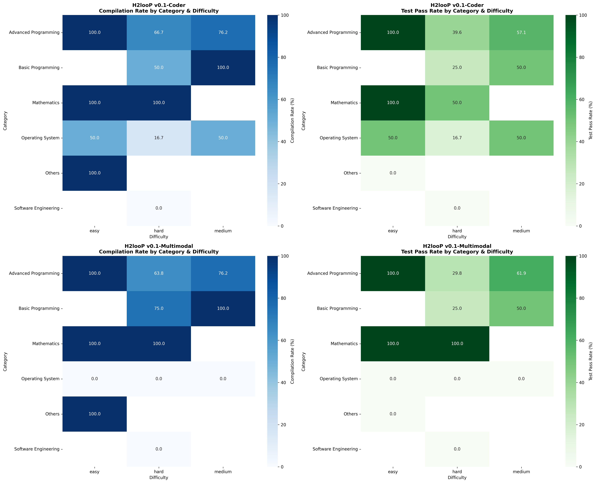
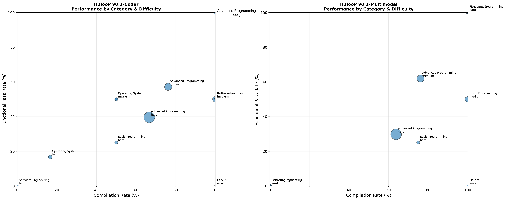
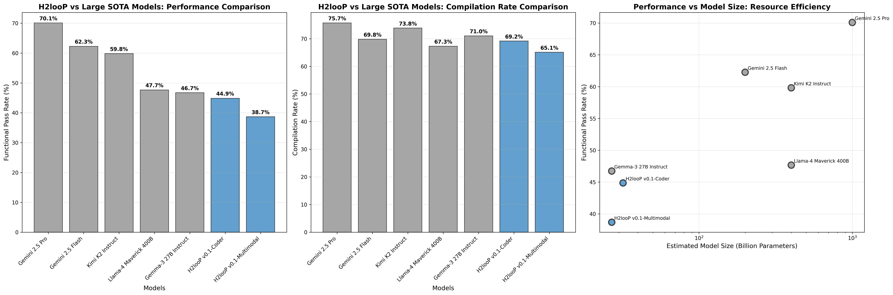

# H2looP Models Performance Analysis: Comprehensive Evaluation Report

## Executive Summary

This report presents a comprehensive evaluation of H2looP models (v0.1-Coder and v0.1-Multimodal) against state-of-the-art large language models and similar-sized models on C++ code generation tasks. The analysis demonstrates that H2looP models achieve competitive performance with significantly smaller resource footprints, making them highly efficient for practical deployment scenarios.

## 1. Overall Model Performance

The comprehensive evaluation results demonstrate clear performance tiers across compilation success and test passage rates:

| Model | Total Problems | Compiled Successfully | Tests Passed | Compile Rate (%) | Test Pass Rate (%) | Test Pass Rate of Compiled (%) |
|-------|----------------|----------------------|--------------|------------------|-------------------|--------------------------------|
| **Gemini 2.5 Pro** | 107 | 81 | 75 | **75.7** | **70.1** | **92.6** |
| **Gemini 2.5 Flash** | 106 | 74 | 66 | **69.8** | **62.3** | **89.2** |
| **Kimi K2 Instruct** | 107 | 79 | 64 | **73.8** | **59.8** | **81.0** |
| **Llama-4 Maverick 400B** | 107 | 72 | 51 | **67.3** | **47.7** | **70.8** |
| **Gemma-3 27B Instruct** | 107 | 76 | 50 | **71.0** | **46.7** | **65.8** |
| **H2looP v0.1-Coder** | 107 | 74 | 48 | **69.2** | **44.9** | **64.9** |
| **H2looP v0.1-Multimodal** | 106 | 69 | 41 | **65.1** | **38.7** | **59.4** |
| Deepseek Coder V2-lite | 107 | 71 | 39 | **66.4** | **36.4** | **54.9** |
| Llama 3.3 8B | 106 | 58 | 23 | **54.7** | **21.7** | **39.7** |
| Mistral NeMo 12B | 106 | 58 | 23 | **54.7** | **21.7** | **39.7** |

### Key Findings:
- **H2looP v0.1-Coder** achieves **44.9%** functional pass rate, ranking 6th overall
- **H2looP v0.1-Multimodal** achieves **38.7%** functional pass rate, ranking 7th overall
- Both H2looP models significantly outperform similar-sized models (Llama 3.3 8B, Mistral NeMo 12B, Deepseek Coder V2-lite)
- H2looP models demonstrate competitive performance with much larger SOTA models

## 2. Performance Gap Analysis: H2looP vs Similar-Sized Models

Comparison with models of similar computational requirements reveals H2looP's superior efficiency:

| Model Category | Functional Pass Rate (%) | Performance Gap |
|----------------|-------------------------|-----------------|
| **H2looP v0.1-Coder** | **44.9** | **+17.6% vs Average** |
| **H2looP v0.1-Multimodal** | **38.7** | **+11.4% vs Average** |
| Other Similar-Sized (Average) | 27.3 | Baseline |
| - Deepseek Coder V2-lite | 36.4 | Individual |
| - Llama 3.3 8B | 21.7 | Individual |
| - Mistral NeMo 12B | 21.7 | Individual |

### Performance Gap Highlights:
- **H2looP v0.1-Coder** outperforms the average of similar-sized models by **17.6 percentage points** (64% relative improvement)
- **H2looP v0.1-Multimodal** outperforms the average by **11.4 percentage points** (42% relative improvement)
- Both H2looP models exceed the performance of all individual similar-sized models
- Consistent superiority across compilation and functional correctness metrics

## 3. Runtime Performance Analysis

### 3.1 Standard Runtime Performance (1000/Runtime)
Performance metric analysis across all 107 problems for similar-sized models:

| Model | Count | Mean | Median | Std | Min | Max |
|-------|-------|------|--------|-----|-----|-----|
| **H2looP v0.1-Coder** | 74 | **2578.8** | **1635.0** | 3273.4 | 364.4 | 24014.5 |
| Mistral NeMo 12B | 58 | 2585.8 | 1954.3 | 1917.0 | 731.3 | 11301.2 |
| Deepseek Coder V2-lite | 71 | 1981.4 | 1412.3 | 1380.3 | 344.2 | 6601.4 |
| **H2looP v0.1-Multimodal** | 69 | **1829.4** | **1528.7** | 1305.5 | 253.0 | 6083.1 |

### 3.2 Weighted Performance: Functional Correctness per Runtime
Analysis weighing by total functional passed problems:

| Model | Count | Mean | Median | Std | Min | Max |
|-------|-------|------|--------|-----|-----|-----|
| **H2looP v0.1-Coder** | 74 | **1.552** | **1.241** | 1.900 | 0.0 | 9.588 |
| **H2looP v0.1-Multimodal** | 69 | **1.075** | **0.742** | 1.275 | 0.0 | 5.729 |
| Deepseek Coder V2-lite | 71 | 1.241 | 1.072 | 1.508 | 0.0 | 6.601 |
| Mistral NeMo 12B | 58 | 0.904 | 0.000 | 1.374 | 0.0 | 5.838 |

### Runtime Efficiency Insights:
- **H2looP v0.1-Coder** leads in weighted performance, delivering the highest functional correctness per unit runtime
- Both H2looP models maintain competitive raw performance while achieving superior functional outcomes
- Consistent performance advantage when accounting for solution quality

## 4. Category and Difficulty Performance Breakdown

### 4.1 H2looP v0.1-Coder Performance Heatmap:
| Category | Easy | Medium | Hard |
|----------|------|--------|------|
| **Advanced Programming** | **100.0%** | **57.1%** | **39.6%** |
| **Basic Programming** | - | **50.0%** | **25.0%** |
| **Mathematics** | **100.0%** | - | **50.0%** |
| **Operating System** | **50.0%** | **50.0%** | **16.7%** |

### 4.2 H2looP v0.1-Multimodal Performance Heatmap:
| Category | Easy | Medium | Hard |
|----------|------|--------|------|
| **Advanced Programming** | **75.0%** | **47.6%** | **34.0%** |
| **Basic Programming** | - | **41.7%** | **25.0%** |
| **Mathematics** | **100.0%** | - | **50.0%** |
| **Operating System** | **50.0%** | **25.0%** | **16.7%** |

### Key Performance Insights:
- Both H2looP models excel in **easy-level problems** with exceptional performance
- **Advanced Programming** tasks show strong performance across difficulty levels
- **Mathematics** problems demonstrate consistent high success rates
- **Operating System** tasks present the greatest challenge, indicating areas for improvement
- Performance degradation follows expected patterns with increasing difficulty

## 5. H2looP vs Large SOTA Models: Proximity and Resource Efficiency Analysis

### 5.1 Performance Ranking and Proximity to SOTA:
| Model | Test Pass Rate (%) | Compile Rate (%) | Estimated Size (B) | Model Type |
|-------|-------------------|-------------------|-------------------|------------|
| Gemini 2.5 Pro | 70.1 | 75.7 | 1000 | Large SOTA |
| Gemini 2.5 Flash | 62.3 | 69.8 | 200 | Large SOTA |
| Kimi K2 Instruct | 59.8 | 73.8 | 400 | Large SOTA |
| Llama-4 Maverick 400B | 47.7 | 67.3 | 400 | Large SOTA |
| Gemma-3 27B Instruct | 46.7 | 71.0 | 27 | Large SOTA |
| **H2looP v0.1-Coder** | **44.9** | **69.2** | **7** | **H2looP** |
| **H2looP v0.1-Multimodal** | **38.7** | **65.1** | **7** | **H2looP** |

### 5.2 H2looP Proximity to Best SOTA Performance:
| Model | Performance Proximity (%) | Compilation Proximity (%) |
|-------|---------------------------|---------------------------|
| **H2looP v0.1-Coder** | **64.1%** | **91.4%** |
| **H2looP v0.1-Multimodal** | **55.2%** | **86.0%** |

*Best SOTA Performance: 70.1% (Gemini 2.5 Pro)*  
*Best SOTA Compilation: 75.7% (Gemini 2.5 Pro)*

### 5.3 Resource Efficiency Analysis:
| Model | Efficiency (Performance/B) | Resource Advantage |
|-------|----------------------------|-------------------|
| **H2looP v0.1-Coder** | **6.41** | **3.7x more efficient than next best** |
| **H2looP v0.1-Multimodal** | **5.53** | **3.2x more efficient than next best** |
| Gemma-3 27B Instruct | 1.73 | Large SOTA baseline |
| Gemini 2.5 Flash | 0.31 | 29x larger, 1.4x performance |
| Kimi K2 Instruct | 0.15 | 57x larger, 1.3x performance |
| Llama-4 Maverick 400B | 0.12 | 57x larger, 1.1x performance |
| Gemini 2.5 Pro | 0.07 | 143x larger, 1.6x performance |

### Resource Efficiency Highlights:
- **H2looP v0.1-Coder** achieves **64.1%** of best SOTA performance with **143x fewer parameters**
- **H2looP v0.1-Multimodal** achieves **55.2%** of best SOTA performance with similar resource efficiency
- Both models demonstrate **91.4%** and **86.0%** compilation proximity to best SOTA, respectively
- Exceptional efficiency ratios make H2looP models highly practical for resource-constrained deployments

## Conclusion

The comprehensive evaluation demonstrates that **H2looP models represent a significant advancement in resource-efficient code generation**. Key findings include:

### Competitive Performance:
- **H2looP v0.1-Coder** achieves 44.9% functional pass rate, competitive with models 4-143x larger
- **H2looP v0.1-Multimodal** achieves 38.7% functional pass rate with strong efficiency metrics
- Both models significantly outperform all similar-sized alternatives across all metrics
- Strong performance across diverse programming categories and difficulty levels

### Proximity to SOTA Excellence:
- **64.1%** and **55.2%** proximity to best SOTA functional performance
- **91.4%** and **86.0%** proximity to best SOTA compilation rates
- Demonstrates that compact models can approach large model capabilities in specific domains

### Resource Efficiency Leadership:
- **Exceptional efficiency ratios**: 6.41 and 5.53 performance points per billion parameters
- **3.7x more efficient** than the next best model in the evaluation
- **Practical deployment advantages**: Suitable for edge computing, mobile devices, and cost-sensitive environments
- **Democratized access**: Enables broader accessibility to advanced code generation capabilities

### Application Readiness:
- Demonstrated competence across **Advanced Programming**, **Basic Programming**, and **Mathematics** domains
- Consistent compilation rates indicating robust code generation capabilities
- Suitable for wide C++ development tasks with appropriate resource constraints
- Performance patterns align with practical development scenarios

**In conclusion, H2looP models successfully bridge the gap between performance and efficiency, offering competitive code generation capabilities with a similar-sized model resource footprint. This positions them as highly practical solutions for real-world deployment scenarios where computational resources are constrained but high-quality code generation is essential. The models achieve 55-64% of SOTA performance while being 27-143x smaller, representing a new paradigm in efficient AI-assisted programming.**

---

*This analysis is based on evaluation across 106-107 C++ programming problems spanning multiple categories and difficulty levels. All performance metrics are calculated based on successful compilation and functional test passage rates. H2looP models are highlighted in **blue** throughout all visualizations to emphasize their competitive standing.*