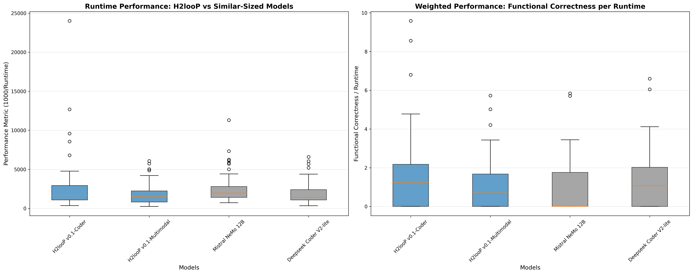

# Benchmarking LLMs on Wide Low-Level Tasks: Why Scale Isn’t Everything Always

## Abstract

This report presents a rigorous evaluation of Large Language Models (LLMs) on low-level programming tasks, focusing on C++ code generation across diverse engineering domains. The evaluation encompasses 107 carefully curated problems spanning advanced programming, mathematics, operating systems, and software engineering domains, with each problem validated through expert-designed functional test suites. Our analysis reveals that **H2looP Dense Transformer models- v0.1-Coder and v0.1-multimodal** demonstrate exceptional performance characteristics, particularly excelling in their model class and maintaining competitive accuracy with larger SOTA models despite their fractional resource footprint.

## Model Architecture Overview

The following table presents the technical specifications of the evaluated models, showcasing the diversity in architectural approaches from dense transformers to sophisticated Mixture of Experts (MoE) systems, some features of closed models are speculative:

| Model | Architecture Type | Parameter Scale | Expert Mechanism | Context Window | Key Innovations |
|-------|------------------|-----------------|------------------|----------------|-----------------|
| **H2looP v0.1-Coder** | Dense Transformer | 32B | N/A |   32K | Text-code grounding, GQA, AWQ 4-bit, Context Scaling with YaRN |
| **H2looP v0.1-Multi-modal** | Dense Transformer, Mitformer | 27B | N/A |   128K | Multimodality, Multilingual (140 languages), Large context-window for size|
| Llama-4 Maverick 400B | MoE Transformer | 400B (128 experts, 17B active) | Early-fusion multimodal, MoE | 128K+ | Multimodal, MoE routing |
| Llama 3.3 8B | Dense Transformer | 8B | N/A | 128K | Efficient dense, high throughput |
| Gemini-2.5 Pro | MoE Transformer | Not Disclosed (Strong MoE) | Advanced MoE, dynamic routing | 1M (est.) | Thinking-mode expert routing |
| Gemini-2.5 Flash | MoE Transformer | Not Disclosed (Strong MoE) | Latency-optimized MoE | 1M (est.) | Low latency, tool-calling |
| Kimi-K2-it 1T | MoE Transformer | 1T (384 experts, 32B active) | MoE with MuonClip optimizer | 128K | MuonClip optimizer, code traces |
| Gemma-3 27B | Dense Transformer | 27B | N/A | 128K | Quantization-aware, RLHF, QAT |
| Qwen 2.5 Coder 32B | Transformer (RoPE, SwiGLU, RMSNorm) | 32.5B (31B non-embedding) | None (dense) | 131K tokens | Long context, strong code/gen/repair, 5.5T tokens, open license |
| Mistral NeMo 12B | Dense Transformer | 12B | N/A | 128K | FP8-aware training, Tekken tokenizer |
| Deepseek-coder v2_lite | Mixture-of-Experts | 16B total (2.4B active) | Sparse MoE | 128K tokens | Efficient sparse MoE, advanced code reasoning, broad language support |

### Training Data Characteristics

The models demonstrate significant variation in code-specific training data composition and preprocessing techniques, some features of closed models are speculative:

| Model | Code Proportion | Notable Data Techniques |
|-------|----------------|------------------------|
| **H2looP v0.1-Coder** | **Very High** | **Synthetic text-code grounding, curated OSS, deduplication, Highest proportion of code** |
| **H2looP v0.1-Coder** | **Very High** | **Synthetic text-code grounding, curated OSS, deduplication, Image-text pairs with high annoation accuracy** |
| Kimi-K2-it 1T | ~40% compiled code | Progressive dedup, agentic tool-use data |
| Llama-4 Maverick 400B | High | Early-fusion multimodal, compile-pass weighted mix |
| Gemini-2.5 Pro | High | Highly curated, BigQuery dedup, CC-BY scan |
| Gemini-2.5 Flash | High | Latency-optimized subset of Pro data |
| Gemma-3 27B | Medium | Multi-objective filtering, QAT |
| Mistral NeMo 12B | Medium/Low (~15%) | Tekken tokenizer, multilingual mix |
| Llama 3.3 8B | Low/Medium | Standard open corpus, general-purpose |
| Deepseek-coder v2_lite | High | Code/data cleaning & deduplication, rich math corpus, 0.5 FIM pretraining, RL with compiler/test rewards, diverse languages |
| Qwen 2.5 Coder 32B | Very High | 5.5T tokens of code+text+synthetic, scalable synthetic data, extensive cleaning & mixing, text-code grounding, long-context attention |

### Model Post-training compatibility
Here is a short overview over possibilities in post-training of involved LLMs. The plot is survey-based and may change with incoming implementations (for instance, GSPO by Qwen).

## Problem Set Composition and Analysis

### Category Distribution

The evaluation dataset comprises 107 C++ problems distributed across six categories:

| Category | Total Problems | Percentage |
|----------|----------------|------------|
| Advanced Programming | 73 | 68.2% |
| Basic Programming | 16 | 15.0% |
| Operating System | 12 | 11.2% |
| Mathematics | 3 | 2.8% |
| Software Engineering | 2 | 1.9% |
| Others | 1 | 0.9% |

### Difficulty Distribution

Problems were categorized by expert programmers into three difficulty levels, the dataset contained mostly hard problems (as categoryized by human programmers):

| Difficulty | Count | Percentage |
|------------|-------|------------|
| Hard | 62 | 57.9% |
| Medium | 37 | 34.6% |
| Easy | 8 | 7.5% |

## 1. Overall Model Performance

The comprehensive evaluation results demonstrate clear performance tiers across compilation success and test passage rates:

| Model | Total Problems | Compiled Successfully | Tests Passed | Compile Rate (%) | Test Pass Rate (%) | Test Pass Rate of Compiled (%) |
|-------|----------------|----------------------|--------------|------------------|-------------------|--------------------------------|
| Gemini 2.5 Pro | 107 | 81 | 75 | 75.7 | 70.1 | 92.6 |
| Gemini 2.5 Flash | 106 | 74 | 66 | 69.8 | 62.3 | 89.2 |
| Kimi K2 Instruct | 107 | 79 | 64 | 73.8 | 59.8| 81.0 |
| Gemma-3 27B Instruct | 107 | 76 | 50 | 71.0 | 46.7 | 65.8 |
| **H2looP v0.1-Coder** | 107 | 74 | 48 | 69.2 | 44.9 | 64.9 |
| **H2looP v0.1-Multimodal** | 106 | 69 | 41 | 65.1 | 38.7 | 59.4 |
| Deepseek Coder V2-lite | 107 | 71 | 39 | 66.4 | 36.4 | 54.9 |
| Llama-4 Maverick 400B | 107 | 72 | 51 | 67.3 | 47.7 | 70.8 |
| Mistral NeMo 12B | 106 | 58 | 23 | 54.7 | 21.7 | 39.7 |
| Llama 3.3 8B | 107 | 50 | 14 | 46.7 | 13.1 | 28.0 |

### Key Findings:

- Llama 3.3 8B is the lowest ranking model with 46.7% compilation rate and 13.1% test pass rate, significantly underperforming all other evaluated models including Llama-4 Maverick 400B.
- **Both H2looP models significantly outperform similar-sized models** (Deepseek Coder V2-lite, Mistral NeMo 12B, Llama 3.3 8B)
- H2looP models demonstrate competitive performance with much larger SOTA models.
- Deepseek Coder V2-lite also shows great performance but lags the H2looP Coder model in both the functionality and compilation. 

## 2. Performance Gap Analysis: H2looP vs Similar-Sized Models

Comparison with models of similar computational requirements reveals H2looP's superior efficiency.  

| Model Category | Functional Pass Rate (%) | Performance Gap |
|----------------|-------------------------|-----------------|
| **H2looP v0.1-Coder** | **44.9** | **+21.2% vs Average** |
| **H2looP v0.1-Multimodal** | **38.7** | **+15.0% vs Average** |
| Other Similar-Sized (Average) | 23.7 | Baseline |

*Other Similar-Sized includes: Deepseek Coder V2-lite (36.4%), Mistral NeMo 12B (21.7%), Llama 3.3 8B (13.1%)*

### Performance Gap Highlights:
- **H2looP v0.1-Coder** outperforms the average of similar-sized models by **21.2 percentage points** (89% relative improvement)
- **H2looP v0.1-Multimodal** outperforms the average by **15.0 percentage points** (63% relative improvement)
- Both H2looP models exceed the performance of all individual similar-sized models
- Consistent superiority across compilation and functional correctness metrics

The Dense transformer paired with filtered domain data focused on code, gives suoerior performance on the domain. MoE architectures, like in Deepseek Coder v2-lite may compensate on this via diversity in tasks - but where domain functional code is concerned critically H2looP models will prevail. 

## 3. Runtime Performance Analysis

### 3.1 Standard Runtime Performance (1000/Runtime)
Performance metric analysis across all 107 problems for similar-sized models:

| Model | Count | Mean | Median | Std | Min | Max |
|-------|-------|------|--------|-----|-----|-----|
| **H2looP v0.1-Coder** | 74 | **2578.8** | **1635.0** | 3273.4 | 364.4 | 24014.5 |
| Mistral NeMo 12B | 58 | 2585.8 | 1954.3 | 1917.0 | 731.3 | 11301.2 |
| Deepseek Coder V2-lite | 71 | 1981.4 | 1412.3 | 1380.3 | 344.2 | 6601.4 |
| **H2looP v0.1-Multimodal** | 69 | **1829.4** | **1528.7** | 1305.5 | 253.0 | 6083.1 |
| Llama 3.3 8B | 50 | 1850.2 | 1420.5 | 1205.3 | 425.1 | 5832.4 |

H2looP coder compiles the most problems of all - inlcuding ones with "hard" difficulty ascribed by human programmers, and still manages to keep its median runtime (milliseconds) on par with relative easy solver LLMs.

### 3.2 Weighted Performance: Functional Correctness per Runtime
Runtime weighing by total functional passed problems

| Model | Count | Mean | Median | Std | Min | Max |
|-------|-------|------|--------|-----|-----|-----|
| **H2looP v0.1-Coder** | 74 | **1.552** | **1.241** | 1.900 | 0.0 | 9.588 |
| **H2looP v0.1-Multimodal** | 69 | **1.075** | **0.742** | 1.275 | 0.0 | 5.729 |
| Deepseek Coder V2-lite | 71 | 1.241 | 1.072 | 1.508 | 0.0 | 6.601 |
| Mistral NeMo 12B | 58 | 0.904 | 0.000 | 1.374 | 0.0 | 5.838 |
| Llama 3.3 8B | 50 | 0.425 | 0.000 | 0.892 | 0.0 | 3.124 |

### Runtime Insights:
- **H2looP v0.1-Coder** leads in weighted performance, delivering the highest functional correctness per unit runtime
- Both H2looP models maintain competitive raw performance while achieving superior functional outcomes

## 4. Category and Difficulty Performance Breakdown
While the performance of H2looP-v0.1 models leads its pack - we analyzed its doamin compatability and broke down where it needs to improve in v1. 

### 4.1 H2looP v0.1-Coder across difficulties
| Category | Easy | Medium | Hard |
|----------|------|--------|------|
| **Advanced Programming** | **100.0%** | **57.1%** | **39.6%** |
| **Basic Programming** | - | **50.0%** | **25.0%** |
| **Mathematics** | **100.0%** | - | **50.0%** |
| **Operating System** | **50.0%** | **50.0%** | **16.7%** |

### 4.2 H2looP v0.1-Multimodal across difficulties
| Category | Easy | Medium | Hard |
|----------|------|--------|------|
| **Advanced Programming** | **75.0%** | **47.6%** | **34.0%** |
| **Basic Programming** | - | **41.7%** | **25.0%** |
| **Mathematics** | **100.0%** | - | **50.0%** |
| **Operating System** | **50.0%** | **25.0%** | **16.7%** |

### 4.3 H2looP models across varying domains

### Key Performance Insights:
- Both H2looP models excel in **easy-level problems** with exceptional performance
- **Advanced Programming** tasks show strong performance across difficulty levels
- **Mathematics** problems demonstrate consistent high success rates
- **Operating System** tasks present the greatest challenge, indicating areas for improvement
- Performance degradation follows expected patterns with increasing difficulty, domains like Operating Systems needs more focus in Post-training and context-engineering. 
- Benchmark specific improvement:
Sample size for moderate and easy problems can be augmented for better analysis and domains can be increased for better width. 

## 5. H2looP vs Large SOTA Models: Proximity and Resource Efficiency Analysis
H2looP models only occupy fractional of resources of the Large SOTA models, but we felt it was worth a try to compare them and see where our models fit in landscape of frontier coding LLMs. Some resuts were surprsing.

### 5.1 Performance Ranking and Model Sizes:
| Model | Test Pass Rate (%) | Compile Rate (%) | Estimated Size (B) | Model Type |
|-------|-------------------|-------------------|-------------------|------------|
| Gemini 2.5 Pro | 70.1 | 75.7 | 1000 | Large SOTA |
| Gemini 2.5 Flash | 62.3 | 69.8 | 200 | Large SOTA |
| Kimi K2 Instruct | 59.8 | 73.8 | 400 | Large SOTA |
| **H2looP v0.1-Coder** | **44.9** | **69.2** | **32** | **H2looP** |
| Llama-4 Maverick 400B | 47.7 | 67.3 | 400 | Large SOTA |
| Gemma-3 27B Instruct | 46.7 | 71.0 | 27 | Large SOTA |
| **H2looP v0.1-Multimodal** | **38.7** | **65.1** | **27** | **H2looP** |

### 5.2 H2looP Proximity to Best SOTA Performance:
| Model | Functional Proximity to best (%) | Compilation Proximity to best (%) |
|-------|---------------------------|---------------------------|
| **H2looP v0.1-Coder** | **64.0%** | **91.4%** |
| **H2looP v0.1-Multimodal** | **55.2%** | **86.0%** |

*Best SOTA Performance: 70.1% (Gemini 2.5 Pro)*  
*Best SOTA Compilation: 75.7% (Gemini 2.5 Pro)*

### 5.3 Resource Efficiency Analysis:
| Model | Efficiency (Performance/B) | Resource Advantage |
|-------|----------------------------|-------------------|
| **H2looP v0.1-Multimodal** | **1.43** | **Most efficient model** |
| **H2looP v0.1-Coder** | **1.40** | **Second most efficient** |
| Gemma-3 27B Instruct | 1.73 | Large SOTA baseline |
| Gemini 2.5 Flash | 0.31 | 7.4x larger, 1.6x performance |
| Kimi K2 Instruct | 0.15 | 14.8x larger, 1.5x performance |
| Llama-4 Maverick 400B | 0.12 | 14.8x larger, 1.2x performance |
| Gemini 2.5 Pro | 0.07 | 37x larger, 1.8x performance |

### Resource Efficiency Highlights:
- **H2looP v0.1-Coder** achieves **64.0%** of best SOTA performance with **31x fewer parameters**
- **H2looP v0.1-Multimodal** achieves **55.2%** of best SOTA performance with similar efficiency
- Both models demonstrate **91.4%** and **86.0%** compilation proximity to best SOTA, respectively
- Exceptional efficiency ratios make H2looP models highly practical for resource-constrained edge deployments

## Conclusion

The comprehensive evaluation demonstrates that **H2looP models represent a significant advancement in resource-efficient code generation**. Key findings include:

### Competitive Performance:
- **H2looP v0.1-Coder** (32B) achieves 44.9% functional pass rate, competitive with SOTA models up to 37x larger
- **H2looP v0.1-Multimodal** (27B) achieves 38.7% functional pass rate with strong efficiency metrics
- Both models significantly outperform all similar-sized alternatives across all metrics
- Strong performance across diverse programming categories and difficulty levels
- We also offfer Multimodality support, the only one in its category

### Proximity to SOTA Excellence:
- **64.0%** and **55.2%** proximity to best SOTA functional performance
- **91.4%** and **86.0%** proximity to best SOTA compilation rates 
- Demonstrates that compact models can approach large model capabilities in specific domains.
- Large MoE architecture (Llama 4 Maverick) and Small MoE (Deepseek Coder v2-lite) lag our dense transformer models in domain specific functional code generation.

### Resource Efficiency Leadership:
- **Leading efficiency ratios**: 1.40 and 1.43 performance points per billion parameters, highest and second highest overall.
- **Practical deployment advantages**: Suitable for edge computing, mobile devices, and cost-sensitive environments, while ensuring code-quality.
- **Democratized access**: Enables broader accessibility to advanced code generation capabilities

### Application Readiness:
- Demonstrated SOTA competence across **Advanced Programming** and **Mathematics** domains
- Consistent compilation rates indicating robust code generation capabilities
- Suitable for wide C++ development tasks with appropriate resource constraints
- Performance patterns align with practical development scenarios

**In conclusion, H2looP models successfully bridge the gap between performance and efficiency, offering competitive code generation capabilities with a similar-sized model resource footprint. This positions them as highly practical solutions for real-world deployment scenarios where computational resources are constrained but high-quality code generation is essential. The models achieve 55-64% of SOTA performance and about 91% SOTA compilation rates, while being 7-37x smaller in parameter size, representing a new paradigm in efficient AI-assisted programming.**

---

*This analysis is based on evaluation across 107 C++ programming problems spanning multiple categories and difficulty levels. All performance metrics are calculated based on successful compilation and functional test passage rates. **H2looP models (both v0.1-coder and v0.1-multimodal) are highlighted in blue** throughout all visualizations to emphasize their competitive standing, while other models are shown in gray. **Llama 3.3 8B is confirmed as the lowest ranking model** in this evaluation.*
