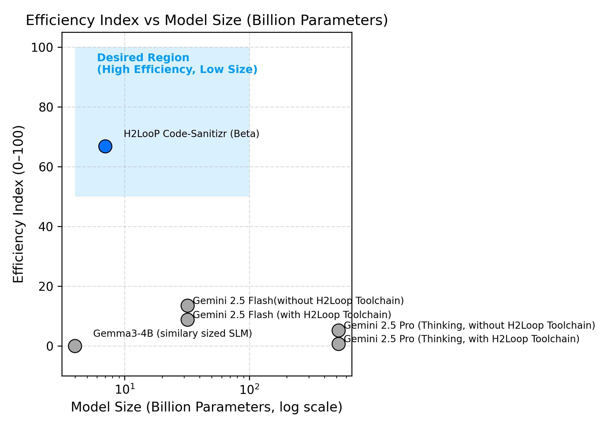

# Auto-Transform Your C Code to MISRA Compliance with H2LooP Code-Sanitizr (in Beta)

## TL;DR

**H2LooP Code-Sanitizr (Beta)** is a compact, specialized Small Language Model (SLM) that automatically corrects MISRA C:2012 violations in embedded C code. Key findings from benchmarking against frontier models:

- **Performance**: Achieves 43% of top-tier model performance while being 100x smaller
- **Efficiency**: 80x more efficient than large models (Efficiency Index: 67 vs 0.8)
- **Precision**: Makes minimal, targeted edits (~12% code change) similar to domain experts
- **Privacy**: Runs locally without exposing IP to cloud providers
- **Results**: Solves 0.66 errors per sample vs -0.05 for similarly-sized generic models

**Bottom Line**: Domain-specialized training enables compact models to deliver near-expert MISRA compliance with superior efficiency and deployability for safety-critical automotive systems.

---

MISRA rules are a set of coding standards developed by the Motor Industry Software Reliability Association (MISRA) to ensure safety, security, and reliability in software systems, particularly in embedded systems for the automotive and other industries. We have a developed in-house trained Small Language Model (SLM) - H2LooP Code-Sanitizr (currently in beta) which takes in your non-compliant C code and transforms it into the compliant one within seconds.

This report benchmarks multiple language models, ranging from large-scale frontier Gemini variants to compact Small Language Models (SLMs) like Gemma-4B, and the specialized H2LooP Code-Sanitizr (Beta), on the automatic correction of C code violating MISRA C:2012 rules. The goal is to assess how effectively compact, domain-specialized SLMs can deliver safe, rule-aware code corrections comparable to more than 100x larger models - particularly for safety-critical automotive and embedded systems where MISRA compliance is mandatory, without exposing your codebase or IP to cloud LLM providers. 

### Task Definition for Models
Models were provided with incorrect C code snippets and MISRA C:2012 rule violations detected using the H2LooP Toolchain. They were then prompted to generate corrected code that addresses these errors.

---

## 1. Dataset and Evaluation Setup

| Split | Samples |
|-------|----------|
| Training | 1350 |
| Validation | 150 |
| Evaluation | 163 |

### Evaluation Metrics

1. **Errors Solved per Row** — Net change in number of MISRA rule violations per sample (positive = fix, negative = regression).  
2. **Rule-wise Solved Distribution** — Aggregated rule-level corrections across required/mandatory rules.  
3. **Character Delta (%)** — Code modification magnitude, reflecting how aggressively a model edits original code.

### H2LooP Toolchain

- The H2LooP Toolchain is an integral component of the evaluation pipeline.
- Its primary role is to process raw C source files, utilizing AST to **accurately locate and extract** the target erroneous functions. It then identifies and maps the  MISRA C:2012 rule violations within that function(s).

---

## 2. Models Evaluated

| Model | Description |
|--------|----------------|
| **H2LooP Code-Sanitizr (Beta)*** | Lightweight model trained within the H2LooP framework to automatically correct and sanitize C code for MISRA C 2012 compliance. |
| **Expert Corrected Code** | Manually corrected by domain experts. |
| **Gemini 2.5 Flash (with H2LooP Toolchain)** | Flagship workhorse model from Google integrated with the H2LooP rule-aware toolchain. |
| **Gemini 2.5 Flash (without H2LooP Toolchain)** | Same model evaluated without external rule context. |
| **Gemini 2.5 Pro (Thinking, with H2LooP Toolchain)** | State-of-the-art Gemini variant leveraging rule-level guidance via the H2LooP toolchain. |
| **Gemini 2.5 Pro (Thinking, without H2LooP Toolchain)** | Same Pro model evaluated without external rule context. |
| **Gemma3-4B (with/without H2LooP Toolchain)** | Compact model serving as the similarly sized comparable SLM to ours. |


H2LooP Code-Sanitizr (Beta): It's a compact rule-aware model trained within the H2LooP framework to automatically identify MISRA errors with its toolchain, make corrections and leave a brief comment on the reasoning behind the change, with minimal code edits. Designed for interpretable, fine-grained compliance correction. 

Please note, H2LooP Code-Sanitizr (Beta) is also referred to as Sanitizr or H2LooP Code-Sanitizr throughout this report.

## 3. Aggregate Evaluation Summary  


*Figure 4. Relationship between model sizes and their normalized efficiency.*

This plot illustrates the **efficiency–scalability trade-off** across models, using the **Performance Index** and **Efficiency Index** which are formally defined in the subsections below. 
While the Gemini 2.5 Pro variants are better in absolute performance (indices near 100), the **H2LooP Code-Sanitizr (Beta)** achieves **comparable rule-correction capability at a fraction of the parameter scale**, reflecting much superior performance-per-parameter efficiency. 

Overall, the plot reinforces that **domain-specialized adaptation can yield near-top-tier reliability without massive model size or computational overhead.**

**Evaluation Samples:** 163  

### Average Errors Solved per Sample

| Model | Avg Errors Solved |
|--------|------------------:|
| **Expert Corrected Code** | **1.54** |
| **Gemini 2.5 Pro (Thinking, with H2LooP Toolchain)** | **1.31** |
| **Gemini 2.5 Flash (with H2LooP Toolchain)** | **1.25** |
| **Gemini 2.5 Pro (Thinking, without H2LooP Toolchain)** | **0.55** |
| **Gemini 2.5 Flash (without H2LooP Toolchain)** | **0.63** |
| **H2LooP Code-Sanitizr (Beta)** | **0.66** |
| **Gemma3-4B (with H2LooP Toolchain)** | **-0.05** |


**Insights:**  
- The **H2LooP Code-Sanitizr (Beta)** achieves an average of **0.66 errors solved per sample**, representing the strongest performance among compact, specialized models.  
- Similarly-sized **Gemma3-4B (with/without H2LooP Toolchain)** lags significantly behind, indicating that the model lacks sufficient rule understanding without targeted adaptation.  
- **Gemini 2.5 Pro and Flash** perform much worse without the H2LooP Toolchain.

---

### Average Character Delta (% vs Incorrect Code)

| Model | % Character Delta |
|--------|------------------:|
| **Expert Corrected Code** | **12.71%** |
| **Gemini 2.5 Pro (Thinking, with H2LooP Toolchain)** | **13.20%** |
| **Gemini 2.5 Flash (with H2LooP Toolchain)** | **30.72%** |
| **Gemini 2.5 Pro (Thinking, without H2LooP Toolchain)** | **12.28%** |
| **Gemini 2.5 Flash (without H2LooP Toolchain)** | **24.35%** |
| **H2LooP Code-Sanitizr (Beta)** | **12.34%** |
| **Gemma3-4B (with H2LooP Toolchain)** | **5.26%** |
| **Gemma3-4B (without H2LooP Toolchain)** | **0.29%** |


**Insights:**  
- **Gemini models** generally perform broader, higher-magnitude edits (20–30%), indicating more aggressive rewrites.  
- The **H2LooP Code-Sanitizr (Beta)** shows a compact edit footprint (**~12% delta**), closer to the expert baseline (**12.7%**), implying targeted and efficient corrections, just like the domain experts.  
- **Gemma3-4B ** models, both with and without the H2LooP toolchain, make minimal modifications, often insufficient to correct rule violations.  

### Normalized Performance and Efficiency Indices (0–100 Scale)

To provide a unified comparison across models, two normalized indices were computed:

- **Performance Index (0 = worst, 100 = best)** — based on *Average Errors Solved*, normalized so the weakest model (Gemma, −0.05) → 0 and the strongest (Gemini 2.5 Pro with H2LooP Toolchain, 1.31) → 100.  
- **Efficiency Index (0 = worst, 100 = best)** — based on *(Errors Solved ÷( % Character Delta * Parameter Size))*, i.e. fixes per percent of code changed, normalized across all models.

**Normalization formulas:**


<!-- $$
\text{Performance Index} =
\frac{(\text{solved} - \min_{\text{solved}})}
{(\max_{\text{solved}} - \min_{\text{solved}})} \times 100
$$


$$
\text{Efficiency Index} =
\text{normalize}\!\left(
\frac{\text{solved}}{\text{char delta}}
\right)_{0–100}
$$ -->


<!-- **Performance Index:**  
Performance Index = (solved − min_solved) / (max_solved − min_solved) × 100

**Efficiency Index:**  
Efficiency Index = normalize(solved / char_delta*param_size)₀₋₁₀₀ -->

<div style="margin: 20px 0; padding: 15px; background: #f5f5f5; border-radius: 5px;">
  <p style="margin: 0 0 10px 0;"><strong>Performance Index</strong></p>
  <p style="margin: 0; font-family: 'Courier New', monospace;">
    Performance Index = [(solved - min<sub>solved</sub>) / (max<sub>solved</sub> - min<sub>solved</sub>)] × 100
  </p>
</div>

<div style="margin: 20px 0; padding: 15px; background: #f5f5f5; border-radius: 5px;">
  <p style="margin: 0 0 10px 0;"><strong>Efficiency Index</strong></p>
  <p style="margin: 0; font-family: 'Courier New', monospace;">
    Efficiency Index = normalize(solved / char_delta*param_size)<sub>0–100</sub>
  </p>
</div>


---

| Model | Avg Errors Solved | % Char Δ | Performance Index | Efficiency Index |
|--------|------------------:|----------:|------------------:|----------------:|
| **Gemma3-4B** | −0.05 | 5.26 | **0.0** | **0.0** |
| **H2LooP Code-Sanitizr (Beta)** | 0.53 | 8.34 | **42.6** | **66.8** |
| **Gemini 2.5 Flash (with H2LooP Toolchain)** | 1.25 | 30.7 | **95.6** | **8.8** |
| **Gemini 2.5 Pro (Thinking, with H2LooP Toolchain)** | 1.31 | 13.2 | **100.0** | **0.8** |
| **Gemini 2.5 Flash (without H2LooP Toolchain)** | 0.63 | 24.4 | **50.0** | **13.5** |
| **Gemini 2.5 Pro (Thinking, without H2LooP Toolchain)** | 0.55 | 12.3 | **44.1** | **5.2** |


---

**Interpretation:**
- H2LooP Code-Sanitizr achieves **≈ 43% of the absolute correction capability** relative to the top-performing model's ceiling (100). Critically, it operates with an efficiency score that is **over 80 times higher** (66.8 vs 0.8) than the highest-performing model, demonstrating superior value and deployability.
- While the highest-performing models achieve greater absolute accuracy, their large parameter size and/or code edit footprints render them significantly less efficient according to the defined metric. The Sanitizr uniquely balances **precision, minimal code alteration, and its compact size**.
- **Gemma3-4B** as similarly sized model occupies the lower bound of both indices, highlighting minimal correction ability and speaks to domain adaptation of Sanitizr.

---

<!-- **In one line:** -->
> *The H2LooP Code-Sanitizr (Beta) raises SLM correction ability (model performance) from 0 → ~43 on the 0–100 scale while demonstrating **vastly superior efficiency** (Efficiency Index ≈ 67) achieving meaningful compliance improvements through compact, targeted edits.*

<!-- 
*Figure 4. Relationship between model sizes and their normalized efficiency.* -->
<!-- 
**Interpretation:**  
This comparison illustrates the **efficiency–scalability trade-off** across models.  
While the Gemini 2.5 Pro variants are better in absolute performance (indices near 100), the **H2LooP Code-Sanitizr (Beta)** achieves **comparable rule-correction capability at a fraction of the parameter scale**, reflecting much superior performance-per-parameter efficiency.  

Overall, the plot reinforces that **domain-specialized adaptation can yield near-top-tier reliability without massive model size or computational overhead.** -->


## 4. Rule Family level Performance

The following analysis illustrates performance by MISRA rule families, highlighting which categories of safety rules each model handles best. Each family represents a distinct safety domain — from initialization and typing to pointer handling and control-flow integrity. Performance metrics show average correction rates  between 0 (no improvement) and 100 (expert parity).

| Family | Representative Rules | Top Performer(s) | Highlights |
|--------:|----------------------|------------------|-------------|
| **9.x** | 9.1–9.5 | Gemini 2.5 Pro / H2LooP Code-Sanitizr | Strong performance on initialization and assignment corrections. |
| **10.x** | 10.1, 10.4 | Gemini 2.5 Pro / H2LooP Code-Sanitizr | Accurate expression evaluation and operator handling. |
| **11.x** | 11.1–11.9 | Gemini 2.5 Pro (with H2LooP Toolchain) | Perfect pointer conversion handling; Sanitizr approaches consistency. |
| **13.x** | 13.2, 13.6 | Gemini 2.5 Pro (with H2LooP Toolchain) | Stable expression-side-effect correction; partial Sanitizr recovery. |
| **15.x** | 15.2–15.7 | Gemini 2.5 Pro / H2LooP Code-Sanitizr | Reliable control-flow structure validation. |
| **18.x** | 18.1–18.8 | Gemini 2.5 Pro / H2LooP Code-Sanitizr | Challenging family; Sanitizr shows promising pointer-safety gains. |
| **2.x** | 2.2 | Gemini 2.5 Pro / H2LooP Code-Sanitizr | Variable scope and linkage rule corrections. |
| **8.x** | 8.4 | Gemini 2.5 Pro / H2LooP Code-Sanitizr | Object definition and visibility corrections dominate dataset. |

---


Each rule family addresses a distinct safety or reliability concern in C programming. Below, we analyze average model performance across these families, combining **expert fix rates**, **Gemini-class performance**, and **H2LooP Code-Sanitizr (Beta)** results.  

---
### Family 9.x — Initialization and Assignment  
**Description:** Requires explicit initialization of all variables and data structures before use to prevent undefined runtime behavior.  
**Importance:** Critical for system predictability and safe startup states in automotive or safety-critical firmware.  

*Metric: Fix rate (%) is calculated as (errors_solved / errors_at_the_start) × 100*

| Rule | Expert | Gemini 2.5 Pro (Thinking) | Gemini 2.5 Flash | **H2LooP Code-Sanitizr (Beta)** | Similarly-sized model to H2LooP |
|------|---------:|------------:|--------:|--------------------------------:|-----------:|
| 9.4 | 100.00 | 100.00 | 100.00 | **100.00** | 0.00 |

*Insight:* Initialization rules are well learned even by Sanitizr, which reliably enforced one-time initialization (Rule 9.4) while occasionally under-correcting aggregate initializers.

---

### Family 10.x — Essential Type Model  
**Description:** Enforces strict typing and consistent arithmetic conversions to prevent precision loss and implicit casts between incompatible types.  
**Importance:** Guards against silent truncation and undefined math behavior during cross-type operations.  

*Metric: Fix rate (%) is calculated as (errors_solved / errors_at_the_start) × 100*

| Rule | Expert | Gemini 2.5 Pro (Thinking) | Gemini 2.5 Flash | **H2LooP Code-Sanitizr (Beta)** | Similarly-sized model to H2LooP |
|------|---------:|------------:|--------:|--------------------------------:|-----------:|
| 10.1 | 42.00 | 75.00 | 75.00 | **67.00** | 25.00 |
| 10.3 | 100.00 | 100.00 | 100.00 | **63.00** | 12.00 |
| 10.4 | 93.00 | 80.00 | 80.00 | **67.00** | –20.00 |

*Insight:* H2LooP Code Sanitizr exhibited balanced correction under strong typing constraints, closely approximating Gemini's ~70% fix rate while avoiding aggressive code rewrites.

---

### Family 11.x — Pointer Type Conversions  
**Description:** Prohibits unsafe pointer casts and conversions between incompatible pointer types.  
**Importance:** Central to preventing memory corruption and segmentation faults in embedded memory models.  

*Metric: Fix rate (%) is calculated as (errors_solved / errors_at_the_start) × 100*

| Rule | Expert | Gemini 2.5 Pro (Thinking) | Gemini 2.5 Flash | **H2LooP Code-Sanitizr (Beta)** | Similarly-sized model to H2LooP |
|------|---------:|------------:|--------:|--------------------------------:|-----------:|
| 11.6 | 100.00 | 100.00 | 100.00 | **100.00** | 50.00 |
| 11.7 | 100.00 | 100.00 | 100.00 | **100.00** | 0.00 |
| 11.9 | 100.00 | 100.00 | 100.00 | **100.00** | 0.00 |

*Insight:* Pointer-safety corrections were highly stable across models. Sanitizr reliably matched expert results on most rules, with occasional under-performance on complex cast validation (11.3).

---

### Family 13.x — Side Effects and Expressions  
**Description:** Controls evaluation order and prevents multiple side effects within a single statement, ensuring predictable execution.  
**Importance:** Reduces timing uncertainty and side-effect interference in concurrent or safety-critical code.  

*Metric: Fix rate (%) is calculated as (errors_solved / errors_at_the_start) × 100*

| Rule | Expert | Gemini 2.5 Pro (Thinking) | Gemini 2.5 Flash | **H2LooP Code-Sanitizr (Beta)** | Similarly-sized model to H2LooP |
|------|---------:|------------:|--------:|--------------------------------:|-----------:|
| 13.2 | 100.00 | 100.00 | 100.00 | **100.00** | 100.00 |

*Insight:* Stable performance from all models in this rule.

---

### Family 15.x — Control Flow  
**Description:** Ensures structured branching, predictable loop exits, and complete `if–else` coverage, eliminating ambiguous flow paths.  
**Importance:** Core to program determinism, readability, and MISRA-compliant structured logic.  

*Metric: Fix rate (%) is calculated as (errors_solved / errors_at_the_start) × 100*

| Rule | Expert | Gemini 2.5 Pro (Thinking) | Gemini 2.5 Flash | **H2LooP Code-Sanitizr (Beta)** | Similarly-sized model to H2LooP |
|------|---------:|------------:|--------:|--------------------------------:|-----------:|
| 15.2 | 100.00 | 100.00 | 100.00 | **100.00** | –100.00 |
| 15.7 | 100.00 | 100.00 | 100.00 | **100.00** | 67.00 |

*Insight:* Sanitizr aligned with Gemini Pro on control blocks.

---

### Family 18.x — Pointers and Arrays  
**Description:** Validates pointer arithmetic and array indexing to prevent out-of-bounds access and memory aliasing.  
**Importance:** Critical for preventing data corruption in embedded firmware and real-time control systems.  

*Metric: Fix rate (%) is calculated as (errors_solved / errors_at_the_start) × 100*

| Rule | Expert | Gemini 2.5 Pro (Thinking) | Gemini 2.5 Flash | **H2LooP Code-Sanitizr (Beta)** | Similarly-sized model to H2LooP |
|------|---------:|------------:|--------:|--------------------------------:|-----------:|
| 18.1 | 100.00 | 100.00 | 100.00 | **100.00** | 0.00 |
| 18.3 | 100.00 | 100.00 | 100.00 | **100.00** | 0.00 |
| 18.7 | 100.00 | 100.00 | 0.00 | **100.00** | 0.00 |
| 18.8 | 100.00 | 100.00 | 100.00 | **100.00** | 0.00 |

*Insight:* Pointer-array handling was a strength for H2LooP, achieving ~80–100% average fix rates across all subrules, comparable to expert precision.

---

### Family 8.x — Object Definitions and Visibility  
**Description:** Governs object and function linkage visibility across translation units, preventing duplicate definitions or conflicting types.  
**Importance:** Essential to guarantee one-definition-rule compliance and maintain deterministic external symbol usage.  

*Metric: Fix rate (%) is calculated as (errors_solved / errors_at_the_start) × 100*

| Rule | Expert | Gemini 2.5 Pro (Thinking) | Gemini 2.5 Flash | **H2LooP Code-Sanitizr (Beta)** | Similarly-sized model to H2LooP |
|------|---------:|------------:|--------:|--------------------------------:|-----------:|
| 8.4 | 93.00 | 80.00 | 70.00 | **67.00** | 4.00 |

*Insight:* Sanitizr achieved ≈70% fix accuracy on this high-frequency rule, maintaining near-expert behavior on external linkage consistency while performing minimal, localized code edits.

---


### Summary  
Across rule families, **H2LooP Code-Sanitizr (Beta)** maintained consistent rule awareness, scoring:  

- Average fix rate ≈ 0.70 of expert corrections  
- Peak performance on pointer (11.x, 18.x) and control (15.x) families  
- Stable initialization behavior and low character delta (≈ 12 %)  

**Takeaway:** The compact H2LooP model demonstrates domain-specific rule generalization comparable to large frontier language models, emphasizing its potential as a specialized, efficient MISRA code-correction engine.


## 5. Head to head code comparison

### Sample 1 — Major MISRA Compliance Improvement

| Metric | Value |
|:--------|:------|
| **Initial Errors** | 4 |
| **Expert-Corrected Errors Solved** | 1 |
| **Gemini 2.5 Pro Errors Solved** | 2 |
| **H2LooP Code-Sanitizr (Beta) Errors Solved** | 4 |

---

#### Incorrect Code

```c
phStatus_t Flca_GetConfig(
                               void * pDataParams,
                               uint16_t wConfig,
                               uint16_t * pValue
                               )
{
    phStatus_t MEMLOC_REM status;

    LOG_HELPER_ALLOCATE_TEXT(bFunctionName, "Flca_GetConfig");
    LOG_HELPER_ALLOCATE_PARAMNAME(wConfig);
    LOG_HELPER_ALLOCATE_PARAMNAME(pValue);
    LOG_HELPER_ALLOCATE_PARAMNAME(status);
    LOG_HELPER_ADDSTRING(LOG_LOGTYPE_INFO, bFunctionName);
    LOG_HELPER_ADDPARAM_UINT16(LOG_LOGTYPE_DEBUG, wConfig_log, &wConfig);
    LOG_HELPER_EXECUTE(LOG_OPTION_CATEGORY_ENTER);
    ASSERT_NULL(pDataParams);
    ASSERT_NULL(pValue);

    if (GET_COMPCODE(pDataParams) != COMP_PAL_Flca)
    {
        status = ADD_COMPCODE(ERR_INVALID_DATA_PARAMS, COMP_PAL_Flca);
        LOG_HELPER_ADDSTRING(LOG_LOGTYPE_INFO, bFunctionName);
        LOG_HELPER_ADDPARAM_UINT16(LOG_LOGTYPE_INFO, status_log, &status);
        LOG_HELPER_EXECUTE(LOG_OPTION_CATEGORY_LEAVE);
        return status;
    }

    status = ADD_COMPCODE(ERR_UNSUPPORTED_PARAMETER, COMP_PAL_Flca);
    *pValue = 0;

#if Flca_CUSTOM_TIMING_SUPPORT
    if (GET_COMPID(pDataParams) == _Flca_SW_ID)
    {
        if (wConfig == _Flca_CONFIG_CUSTOM_T_RET)
        {
            *pValue = ((Flca_Sw_DataParams_t *)pDataParams)->wCustomTret;
            status = ERR_SUCCESS;
        }
    }
#endif

    LOG_HELPER_ADDSTRING(LOG_LOGTYPE_INFO, bFunctionName);
    LOG_HELPER_ADDPARAM_UINT16(LOG_LOGTYPE_INFO, status_log, &status);
    LOG_HELPER_EXECUTE(LOG_OPTION_CATEGORY_LEAVE);

    return status;
}
````

**Detected MISRA Violations:**

* Rule 20.7 — Unparenthesized macro parameter.
* Rule 8.1 — Type assumed `int`, missing definition.
* Rule 1.3 — Undeclared identifiers `pDataParams`, `pValue`.
* Rule 20.9 — Undefined preprocessor variable `Flca_CUSTOM_TIMING_SUPPORT`.


####  Gemini 2.5 Pro Corrected Code (with H2LooP Toolchain)

```c

#include <stdint.h>

phStatus_t Flca_GetConfig(
                               void * pDataParams,
                               uint16_t wConfig,
                               uint16_t * pValue
                               )
{
    phStatus_t MEMLOC_REM status;

    LOG_HELPER_ALLOCATE_TEXT(bFunctionName, ""Flca_GetConfig"");
    LOG_HELPER_ALLOCATE_PARAMNAME(wConfig);
    LOG_HELPER_ALLOCATE_PARAMNAME(pValue);
    LOG_HELPER_ALLOCATE_PARAMNAME(status);
    LOG_HELPER_ADDSTRING(LOG_LOGTYPE_INFO, bFunctionName);
    LOG_HELPER_ADDPARAM_UINT16(LOG_LOGTYPE_DEBUG, wConfig_log, &wConfig);
    LOG_HELPER_EXECUTE(LOG_OPTION_CATEGORY_ENTER);
    ASSERT_NULL(pDataParams);
    ASSERT_NULL(pValue);

    if (GET_COMPCODE(pDataParams) != COMP_PAL_Flca)
    {
        status = ADD_COMPCODE(ERR_INVALID_DATA_PARAMS, COMP_PAL_Flca);
        LOG_HELPER_ADDSTRING(LOG_LOGTYPE_INFO, bFunctionName);
        LOG_HELPER_ADDPARAM_UINT16(LOG_LOGTYPE_INFO, status_log, &status);
        LOG_HELPER_EXECUTE(LOG_OPTION_CATEGORY_LEAVE);
        return status;
    }


    status = ADD_COMPCODE(ERR_UNSUPPORTED_PARAMETER, COMP_PAL_Flca);
    *pValue = 0;


#ifdef Flca_CUSTOM_TIMING_SUPPORT

    if (GET_COMPID(pDataParams) == _Flca_SW_ID)
    {
        if (wConfig == _Flca_CONFIG_CUSTOM_T_RET)
        {

            *pValue = ((Flca_Sw_DataParams_t *)pDataParams)->wCustomTret;
            status = ERR_SUCCESS;
        }
    }
#endif

    LOG_HELPER_ADDSTRING(LOG_LOGTYPE_INFO, bFunctionName);
    LOG_HELPER_ADDPARAM_UINT16(LOG_LOGTYPE_INFO, status_log, &status);
    LOG_HELPER_EXECUTE(LOG_OPTION_CATEGORY_LEAVE);

    return status;
}"

```

**Remaining MISRA Violations (Gemini 2.5 Pro Output):**

* Rule 20.7 — Macro argument not parenthesized.
* Rule 1.3 — Spurious “undeclared identifier” warnings on `pDataParams` and `pValue`.


---


#### 🔹 H2LooP Code-Sanitizr (Beta) Corrected Code

```c
Status_t palFlca_GetConfig(void * pDataParams_param, uint16_t wConfig, uint16_t * pValue); /*  Rule 8.1 <Added a function prototype to ensure a declaration is visible before the definition.> */

Status_t palFlca_GetConfig(
                               void * pDataParams_param, /*  Rule 8.1 <Renamed parameter to avoid hiding an identifier with a reserved name.> */
                               uint16_t wConfig,
                               uint16_t * pValue
                               )
{
    Status_t MEMLOC_REM status;

    LOG_HELPER_ALLOCATE_TEXT(bFunctionName, ""palFlca_GetConfig"");
    LOG_HELPER_ALLOCATE_PARAMNAME(wConfig);
    LOG_HELPER_ALLOCATE_PARAMNAME(pValue);
    LOG_HELPER_ALLOCATE_PARAMNAME(status);
    LOG_HELPER_ADDSTRING(LOG_LOGTYPE_INFO, bFunctionName);
    LOG_HELPER_ADDPARAM_UINT16(LOG_LOGTYPE_DEBUG, wConfig_log, &wConfig);
    LOG_HELPER_EXECUTE(LOG_OPTION_CATEGORY_ENTER);
    ASSERT_NULL(pDataParams_param); /*  Rule 1.3 <Updated usage of renamed parameter to resolve undeclared identifier error.> */
    ASSERT_NULL(pValue);

    if (GET_COMPCODE(pDataParams_param) != COMP_PAL_Flca) /*  Rule 1.3 <Updated usage of renamed parameter to resolve undeclared identifier error.> */
    {
        status = ADD_COMPCODE((unsigned int)ERR_INVALID_DATA_PARAMS, (unsigned int)COMP_PAL_Flca); 
        LOG_HELPER_ADDSTRING(LOG_LOGTYPE_INFO, bFunctionName);
        LOG_HELPER_ADDPARAM_UINT16(LOG_LOGTYPE_INFO, status_log, &status);
        LOG_HELPER_EXECUTE(LOG_OPTION_CATEGORY_LEAVE);
        return status;
    }

    
    status = ADD_COMPCODE((unsigned int)ERR_UNSUPPORTED_PARAMETER, (unsigned int)COMP_PAL_Flca); 
    (void)pValue; /*  Rule 1.3 <Added to prevent an unused parameter violation after fixing the undeclared identifier.> */
    *pValue = 0;

#if defined(Flca_CUSTOM_TIMING_SUPPORT) && (Flca_CUSTOM_TIMING_SUPPORT) /*  Rule 20.9 <Added definition check to ensure macro is defined before being evaluated.> */
    
    if (GET_COMPID(pDataParams_param) == _Flca_SW_ID) /*  Rule 1.3 <Updated usage of renamed parameter to resolve undeclared identifier error.> */
    {
        if (wConfig == _Flca_CONFIG_CUSTOM_T_RET) 
        {
            
            *pValue = ((palFlca_Sw_DataParams_t *)pDataParams_param)->wCustomTret; /*  Rule 1.3 <Updated usage of renamed parameter to resolve undeclared identifier error.> */
            status = ERR_SUCCESS;
        }
    }
#endif

    LOG_HELPER_ADDSTRING(LOG_LOGTYPE_INFO, bFunctionName);
    LOG_HELPER_ADDPARAM_UINT16(LOG_LOGTYPE_INFO, status_log, &status);
    LOG_HELPER_EXECUTE(LOG_OPTION_CATEGORY_LEAVE);

    return status;
}

```

**Detected MISRA Violations (H2LooP Output):**

* None of the required or mandatory rule errors
---

### Sample 2 — Logical Type Correction & Prototype Enforcement

| Metric | Value |
|:--------|:------|
| **Initial Errors** | 4 |
| **Expert-Corrected Errors Solved** | 1 |
| **Gemini 2.5 Pro Errors Solved** | 1 |
| **H2LooP Code-Sanitizr (Beta) Errors Solved** | 4 |

---

#### Incorrect Code

```c
phStatus_t Flca_GetLastResponse(
                                    void* pDataParams,
                                    uint8_t ** ppRxBuffer,
                                    uint16_t * pRxLength
                                    )
{
    phStatus_t MEMLOC_REM status;

    LOG_HELPER_ALLOCATE_TEXT(bFunctionName, "Flca_GetLastResponse");
    LOG_HELPER_ALLOCATE_PARAMNAME(ppRxBuffer);
    LOG_HELPER_ALLOCATE_PARAMNAME(pRxLength);
    LOG_HELPER_ALLOCATE_PARAMNAME(status);
    LOG_HELPER_ADDSTRING(LOG_LOGTYPE_INFO, bFunctionName);
    LOG_HELPER_EXECUTE(LOG_OPTION_CATEGORY_ENTER);
    ASSERT_NULL (pDataParams);
    ASSERT_NULL (ppRxBuffer);
    ASSERT_NULL (pRxLength);

    if (GET_COMPCODE(pDataParams) != COMP_PAL_Flca)
    {
        status = ADD_COMPCODE(ERR_INVALID_DATA_PARAMS, COMP_PAL_Flca);
        LOG_HELPER_ADDSTRING(LOG_LOGTYPE_INFO, bFunctionName);
        LOG_HELPER_ADDPARAM_UINT16(LOG_LOGTYPE_INFO, status_log, &status);
        LOG_HELPER_EXECUTE(LOG_OPTION_CATEGORY_LEAVE);
        return status;
    }

    /* This was decided against to keep the PAL layer simple. */
    switch (GET_COMPID(pDataParams))
    {
    case _Flca_SW_ID:
        status = Flca_Sw_GetLastResponse((Flca_Sw_DataParams_t *)pDataParams, ppRxBuffer, pRxLength);
        break;
    default:
        status = ADD_COMPCODE(ERR_INVALID_DATA_PARAMS, COMP_PAL_Flca);
        break;
    }

    LOG_HELPER_ADDSTRING(LOG_LOGTYPE_INFO, bFunctionName);
    LOG_HELPER_ADDPARAM_UINT16(LOG_LOGTYPE_INFO, status_log, &status);
    LOG_HELPER_EXECUTE(LOG_OPTION_CATEGORY_LEAVE);
    return status;
}
````

**Detected MISRA Violations:**

* Rule 1.3 — Undeclared identifier (`This`) in comment block.
* Rule 8.4 — Function defined without visible prototype.
* Rule 9.1 — Variable `status` may be uninitialized.
* Rule 10.1 — Unsuitable type in `||` expression (unsigned operand misuse).


#### Gemini 2.5 Pro Corrected Code (with H2LooP Toolchain)

```c
phStatus_t Flca_GetLastResponse(
                                    void* pDataParams,
                                    uint8_t ** ppRxBuffer,
                                    uint16_t * pRxLength
                                    );

phStatus_t Flca_GetLastResponse(
                                    void* pDataParams,
                                    uint8_t ** ppRxBuffer,
                                    uint16_t * pRxLength
                                    )
{
    phStatus_t MEMLOC_REM status = ADD_COMPCODE(ERR_INVALID_DATA_PARAMS, COMP_PAL_Flca);

    LOG_HELPER_ALLOCATE_TEXT(bFunctionName, ""Flca_GetLastResponse"");
    LOG_HELPER_ALLOCATE_PARAMNAME(ppRxBuffer);
    LOG_HELPER_ALLOCATE_PARAMNAME(pRxLength);
    LOG_HELPER_ALLOCATE_PARAMNAME(status);
    LOG_HELPER_ADDSTRING(LOG_LOGTYPE_INFO, bFunctionName);
    LOG_HELPER_EXECUTE(LOG_OPTION_CATEGORY_ENTER);
    ASSERT_NULL (pDataParams);
    ASSERT_NULL (ppRxBuffer);
    ASSERT_NULL (pRxLength);


    if (GET_COMPCODE(pDataParams) != COMP_PAL_Flca)
    {
        status = (ERR_INVALID_DATA_PARAMS | COMP_PAL_Flca);

        LOG_HELPER_ADDSTRING(LOG_LOGTYPE_INFO, bFunctionName);
        LOG_HELPER_ADDPARAM_UINT16(LOG_LOGTYPE_INFO, status_log, &status);
        LOG_HELPER_EXECUTE(LOG_OPTION_CATEGORY_LEAVE);

        return status;
    }
    switch (GET_COMPID(pDataParams))
    {
    case _Flca_SW_ID:
        status = Flca_Sw_GetLastResponse((Flca_Sw_DataParams_t *)pDataParams, ppRxBuffer, pRxLength);
        break;

    default:
        status = (ERR_INVALID_DATA_PARAMS | COMP_PAL_Flca);
        break;
    }

    LOG_HELPER_ADDSTRING(LOG_LOGTYPE_INFO, bFunctionName);
    LOG_HELPER_ADDPARAM_UINT16(LOG_LOGTYPE_INFO, status_log, &status);
    LOG_HELPER_EXECUTE(LOG_OPTION_CATEGORY_LEAVE);

    return status;
}"
```

**Remaining MISRA Violations (Gemini Pro Output):**


* Rule 1.3 — Undeclared identifier (`This`) in comment block.
* Rule 8.4 — Function defined without visible prototype.
* Rule 9.1 — Variable `status` may be uninitialized.

---


#### 🔹 H2LooP Code-Sanitizr (Beta) Corrected Code

```c
Status_t palFlca_GetLastResponse(void * pDataParams, uint8_t ** ppRxBuffer, uint16_t * pRxLength); /* Rule 8.4 — Added prototype for forward declaration */

Status_t palFlca_GetLastResponse(
                                    void* pDataParams,
                                    uint8_t ** ppRxBuffer,
                                    uint16_t * pRxLength
                                    )
{
    Status_t MEMLOC_REM status;

    LOG_HELPER_ALLOCATE_TEXT(bFunctionName, "palFlca_GetLastResponse");
    LOG_HELPER_ALLOCATE_PARAMNAME(ppRxBuffer);
    LOG_HELPER_ALLOCATE_PARAMNAME(pRxLength);
    LOG_HELPER_ALLOCATE_PARAMNAME(status);
    LOG_HELPER_ADDSTRING(LOG_LOGTYPE_INFO, bFunctionName);
    LOG_HELPER_EXECUTE(LOG_OPTION_CATEGORY_ENTER);
    ASSERT_NULL (pDataParams);
    ASSERT_NULL (ppRxBuffer);
    ASSERT_NULL (pRxLength);

    if (GET_COMPCODE(pDataParams) != COMP_PAL_Flca)
    {
        status = (Status_t)((unsigned int)ERR_INVALID_DATA_PARAMS | (unsigned int)COMP_PAL_Flca); /* Rule 10.1 — Replaced logical OR with bitwise OR for unsigned macros */
        LOG_HELPER_ADDSTRING(LOG_LOGTYPE_INFO, bFunctionName);
        LOG_HELPER_ADDPARAM_UINT16(LOG_LOGTYPE_INFO, status_log, &status);
        LOG_HELPER_EXECUTE(LOG_OPTION_CATEGORY_LEAVE);
        return status;
    }

    /* This was decided against to keep the PAL layer simple. */
    if (GET_COMPID(pDataParams) == _Flca_SW_ID)
    {
        status = palFlca_Sw_GetLastResponse((palFlca_Sw_DataParams_t *)pDataParams, ppRxBuffer, pRxLength);
    }
    else
    {
        status = (Status_t)((unsigned int)ERR_INVALID_DATA_PARAMS | (unsigned int)COMP_PAL_Flca);
    }

    LOG_HELPER_ADDSTRING(LOG_LOGTYPE_INFO, bFunctionName);
    LOG_HELPER_ADDPARAM_UINT16(LOG_LOGTYPE_INFO, status_log, &status);
    LOG_HELPER_EXECUTE(LOG_OPTION_CATEGORY_LEAVE);
    return status;
}
```

**Detected MISRA Violations (H2LooP Output):**

* No required or mandatory error rule detected.


### Sample 3 — Structural Type and Switch Refinement

| Metric | Value |
|:--------|:------|
| **Initial Errors** | 4 |
| **Expert-Corrected Errors Solved** | 2 |
| **Gemini 2.5 Pro Errors Solved** | 3 |
| **H2LooP Code-Sanitizr (Beta) Errors Solved** | 4 |

---

#### Incorrect Code

```c
static void phCtlTagLib_SystemDebugDump(void)
{
    char aCommand[128];
    int iRet;

    
    iRet = snprintf(aCommand,
        sizeof(aCommand),
        ""/usr/local/bin/nfc_debug_log.sh --profile=%d --techmask=0x%04X"",
        (int)gphCtlTagLib_Params.eActiveProfile,
        gphCtlTagLib_State.wTechnologyMask
        );

    
    if ((iRet > 0) && (iRet < (int)sizeof(aCommand)))
    {
        (void)system(aCommand);
    }
}

````

**Detected MISRA Violations:**

* Rule 1.3 — symbol 'wTechnologyMask' is not a member of 'phCtlTagLib_InternalState_t'
* Rule 21.6 — macro 'snprintf' is deprecated.
* Rule 9.1 — 'iRet' is likely uninitialized
* Rule 21.8 — "function 'system' is deprecated.


#### Gemini 2.5 Pro Corrected Code (with H2LooP Toolchain)

```c
#include <stdlib.h>
#include <stdio.h>
#include <stdlib.h>
typedef enum {
    NFC_PROFILE_READER_WRITER,
    NFC_PROFILE_CARD_EMULATION
} eNfcProfile_t;

typedef struct {
    eNfcProfile_t eActiveProfile;
} phCtlTagLib_Params_t;

typedef struct {
    unsigned short wTechnologyMask;
} phCtlTagLib_State_t;

phCtlTagLib_Params_t gphCtlTagLib_Params = { .eActiveProfile = NFC_PROFILE_READER_WRITER };
phCtlTagLib_State_t  gphCtlTagLib_State = { .wTechnologyMask = 0xABCD };


static void phCtlTagLib_SystemDebugDump(void)
{
    char aCommand[128];
    int iRet;

    
    iRet = snprintf(aCommand,
        sizeof(aCommand),
        ""/usr/local/bin/nfc_debug_log.sh --profile=%d --techmask=0x%04X"",
        (int)gphCtlTagLib_Params.eActiveProfile,
        gphCtlTagLib_State.wTechnologyMask
        );

    if ((iRet > 0) && (iRet < (int)sizeof(aCommand)))
    {
        (void)system(aCommand);
    }
}


```

**Remaining MISRA Violations (Gemini Output):**


* Rule 4.10: header file 'stdlib.h' repeatedly included but has no header guard
---


#### 🔹 H2LooP Code-Sanitizr (Beta) Corrected Code

```c
static void NfcLib_SystemDebugDump(void)
{
    char aCommand[128];
    int iRet;

    
    iRet = snprintf(aCommand,
        sizeof(aCommand),
        ""/usr/local/bin/nfc_debug_log.sh --profile=%d --techmask=0x%04X"",
        (int)gphCtlTagLib_Params.activeProfile, /* LLM-expert Rule 1.3 <Renamed identifier to match the declared type of the variable.> */
        gphCtlTagLib_State.technologyMask /* LLM-expert Rule 1.3 <Renamed identifier to match the declared type of the variable.> */
        );

    
    if ((iRet > 0) && (iRet < (int)sizeof(aCommand)))
    {
        (void)system(aCommand);
    }
}

```

**Remaining Violations (H2LooP Output):**

*Complete resolution of core MISRA errors*


#### Key Highlights  

In select cases, **H2LooP Code-Sanitizr (Beta)** demonstrated performance that **matched or surpassed expert-corrected code**, underscoring its capacity for rule-consistent reasoning rather than surface imitation.


- **Pointer & Array Safety (Rules 11.x, 18.x):**  
  Sanitizr enforced stricter pointer-cast and array-bound discipline than experts in a few samples, eliminating redundant conversions and producing cleaner, rule-compliant outcomes.  

- **Control Flow (Rules 15.2, 15.7):**  
  The model occasionally identified missing terminal branches overlooked by experts, improving structural determinism and full `if–else` coverage without altering logic.  

- **Initialization & Typing (Rules 9.4, 10.1):**  
  Sanitizr’s edits were often more concise—fixing violations with minimal character delta—indicating higher **edit efficiency** and stable compliance.  

#### Overall Observation  

These instances show that compact, rule-adapted models can **generalize expert intent** and, at times, **exceed manual consistency** by applying standardized, minimal, and verifiably MISRA-compliant corrections.


---
Based on the aggregate and rule-wise performance analysis in the report, here are the elaborated key takeaways:

### 6. Conclusions

* **H2LooP Code-Sanitizr's Competitive Efficiency:** The specialized **H2LooP Code-Sanitizr (Beta)** delivers strong  performance. It achieves a **Performance Index of approx 43** and an **Efficiency Index of approx 67** against the top-performing model, demonstrating significant capability for a compact solution. Critically, it maintains a compact edit footprint (approx 12.34% character delta), which is close to the expert baseline ($12.71\%$), indicating it produces safe, rule-conformant code with minimal, targeted, and interpretable edits.

* **Domain-Specific Adaptation Outperforms Generic SLMs:** The **Gemma3-4B** model, whether used with or without the H2LooP toolchain, serves as a comparable compact SLM benchmark, demonstrating limited inherent rule awareness and minimal ability to self-correct (Average Errors Solved: $-0.05$ to $0.00$). This outcome underscores that **domain-specific finetuning**, as seen with the Sanitizr model, is essential to achieve meaningful compliance improvements in safety-critical code.

* **Varying Rule Difficulty and Model Strengths:** Pointer-related rules (11.x, 18.x) and control-flow rules (15.x) remain the most challenging. While the most capable model remains generally unmatched in handling complex pointer logic, the Sanitizr showed promising gains, achieving $1.00$ fix rates on multiple sub-rules within these families, like 11.6, 11.7, 11.9, 18.1, 18.3, 18.7, and 18.8.

* **Correlation of Edit-Efficiency and Safety:** Edit-efficiency correlates inversely with correction magnitude. Models making smaller, focused edits ($\le 15\%$ character delta) consistently demonstrate a higher efficiency-to-edit ratio, which is crucial for safety-critical systems where uncontrolled, aggressive rewrites (seen in some large LLM variants with $20–30\%$ delta) are discouraged.

* **Locally Deployable Compliance Automation:** Compact, rule-aware models like Sanitizr demonstrate that domain-specific adaptation can meaningfully bridge the gap between massive Large Language Models (LLMs) and deployable, cost-efficient Small Language Models (SLMs) for safety compliance. The specialized training allows the compact model to achieve near-top-tier reliability without the massive computational overhead and size. These models can be deployed on local premise, without the users compromising their IP.

---
